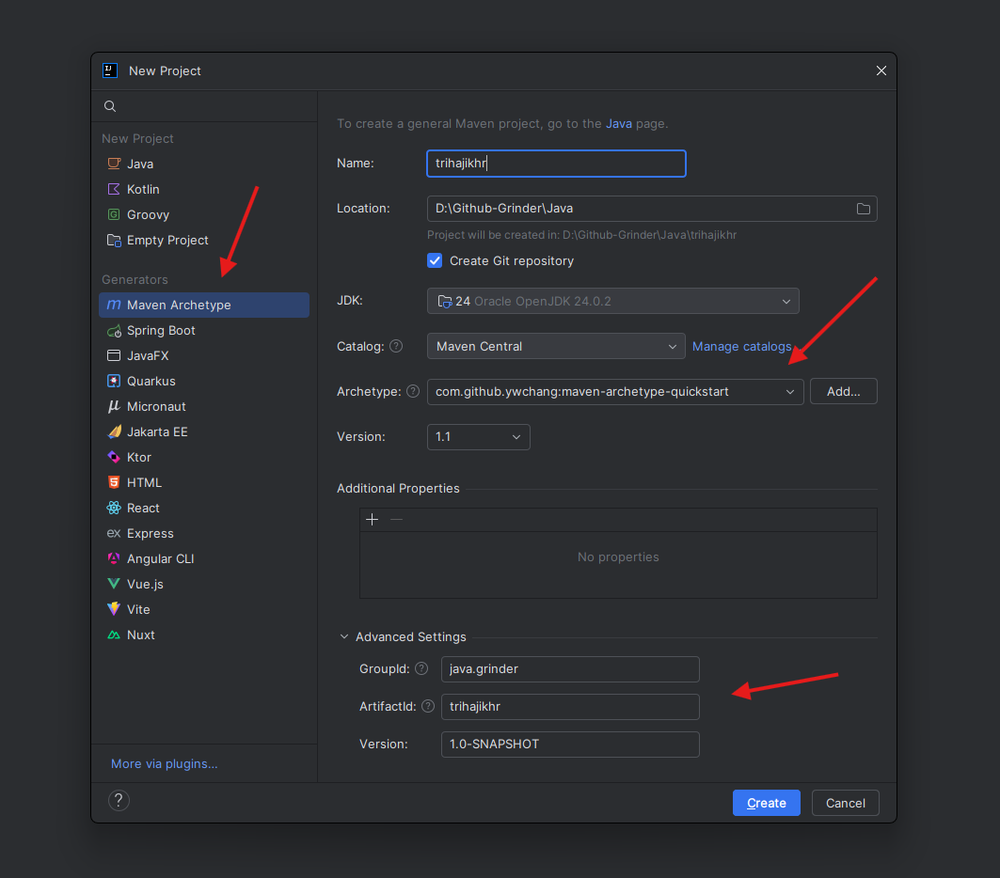

# 2 | Memulai SQLite di IntelliJ

## 1 | Pengertian SQLite

SQLite adalah basis data relasional yang bersifat ringan dan berbasis berkas (*file-based*). Seluruh basis data disimpan dalam satu berkas tunggal pada sistem file, sehingga tidak memerlukan server terpisah. Jika sebelumnya sebagian besar mempelajari SQL menggunakan XAMPP yang membutuhkan server berjalan terlebih dahulu, SQLite berbeda. Berikut adalah perbedaan utama antara MySQL dan SQLite:

### 1.1 | Arsitektur

* **MySQL** bersifat *server-based*, artinya terdapat server yang selalu berjalan, dan aplikasi Java hanya berfungsi sebagai klien yang terhubung ke server tersebut. Konfigurasi ini sesuai untuk aplikasi yang diakses oleh banyak pengguna secara bersamaan.
* **SQLite** bersifat *file-based*, artinya basis data hanya berupa satu berkas `.db` pada komputer. Tidak diperlukan server; aplikasi Java dapat langsung membaca dan menulis ke berkas tersebut.

### 1.2 | Skalabilitas dan Multi-User

* MySQL cocok untuk **aplikasi berskala besar dan multi-pengguna**, mampu menangani ratusan hingga ribuan koneksi secara bersamaan.
* SQLite lebih sesuai untuk **aplikasi kecil atau desktop**. Dukungan multi-pengguna terbatas, hanya memungkinkan *concurrent read*, sedangkan operasi tulis secara bersamaan menjadi lebih rumit.

### 1.3 | Instalasi dan Pengaturan

* MySQL memerlukan instalasi server, konfigurasi pengguna, kata sandi, port, dan sebagainya.
* SQLite sangat mudah digunakan: cukup menambahkan library JDBC, dan berkas `.db` dapat langsung digunakan. Hal ini sangat sesuai untuk pembelajaran, prototyping, atau proyek mahasiswa. Dan mungkin jadi alasan kenapa banyak dosen meminta mahasiswa membuat projek dengan jenis database ini.

### 1.4 | Fitur

* MySQL menyediakan fitur lanjutan seperti *stored procedures*, *triggers* kompleks, *replication*, dan *clustering*.
* SQLite menawarkan fitur dasar seperti transaksi, *foreign key*, dan perintah SQL standar. SQLite tidak menyediakan *stored procedures*, manajemen pengguna, atau scripting di sisi server.

### 1.5 | Alasan Pemilihan SQLite

- **Praktis dan ringan** → mahasiswa tidak perlu melakukan konfigurasi server.
- **Berdasarkan berkas** → mudah dikirim, diarsipkan (*zip*), atau di-*commit* ke proyek.
- **Cukup untuk belajar SQL dan operasi CRUD** tanpa harus mengkhawatirkan konfigurasi server atau manajemen multi-pengguna.

---

## 2 | Pemasangan SQLite

Untuk pemasangan SQLite pada Intellij tergolong mudah. Anggap saja kita adalah pengguna Java yang cakap dan modern (😂 misal), mungkin kita akan menggunakan salah satu Java build tool, seperti Maven, Gradle, atau sejenisnya. Disini aku akan mencontohkan semisal kita membuat project java menggunakan Maven.

Jika bingung, baca materi buatanku tentang [Apache Maven Java](../../../19-build-tools/maven/theory/01-Apache-Maven-Java.md). Jika tidak mau ambil pusing, buat saja projek baru, lalu ikuti pilihan berikut:



Pada menu _Generators_, pilih `Maven Archetype`. Pada opsi _Archetype_ bisa dipilih opsi `maven-archetype-quickstart`, dan pada pengisian _Advanced Settings_, atur penamaan package jika perlu. Tapi opsi _Advanced Settings_ tidak perlu kamu utak-atik jika kamu tidak paham bagaimana struktur project atau folder yang dikelola oleh Maven, skip saja, dan bisa langsung tekan _Create_.   

Setelah itu, pasti akan dibuat project Java yang mana terdapat sebuah file bernama `pom.xml`. Folder inilah tempat kita manaruh dependency dari setiap library yang kedepanya kita butuhkan. Tanpa Maven, setiap kita membutuhkan library, kita harus install manual, dan mengatur pathnya sedemikian rupa. Tapi dengan Maven, kita hanya perlu pergi ke situs [Maven Repository](https://mvnrepository.com/), cari library yang kita butuhkan, salin dependency, taruh di `pom.xml`, refresh, dan.. sudah, selesai, anti ribet.

> `pom.xml` adalah _Project Object Model_ file di Maven. Bisa dibilang ini “otak proyek” yang memberitahu Maven apa yang harus dilakukan dengan project Java-mu.  Secara spesifik, `pom.xml` menyimpan konfigurasi dan metadata proyek,

Oke, karena untuk menggunakan SQLite kita membutuhkan library [SQLite JDBC](https://mvnrepository.com/artifact/org.xerial/sqlite-jdbc), maka kita tinggal cari library yang kita butuhkan di Maven Repository:


Pilih versi terbaru, lalu salin dependency yang bisa kita salin:


Mungkin kurang lebih seperti ini:

```xml
<!-- https://mvnrepository.com/artifact/org.xerial/sqlite-jdbc -->
<dependency>
    <groupId>org.xerial</groupId>
    <artifactId>sqlite-jdbc</artifactId>
    <version>3.51.0.0</version>
</dependency>
```

Setelah itu, buka file dengan nama `pom.xml`, pasti ada didalam folder projectmu:


Lalu buka, dan taruh salinan dependency tadi ke dalam tag `dependencies` yang ada, mungkin berikut adalah perbandingan sebelum dan sesudah:

Sebelum:

```xml
  <dependencies>
      <dependency>
         <groupId>org.junit.jupiter</groupId>
         <artifactId>junit-jupiter-engine</artifactId>
         <version>5.7.1</version>
         <scope>test</scope>
      </dependency>
        <dependency>
          <groupId>org.junit.jupiter</groupId>
          <artifactId>junit-jupiter-params</artifactId>
          <version>5.7.1</version>
          <scope>test</scope>
        </dependency>
  </dependencies>
```

Sesudah:

```xml
  <dependencies>
    <!-- https://mvnrepository.com/artifact/org.xerial/sqlite-jdbc -->
      <dependency>
         <groupId>org.xerial</groupId>
         <artifactId>sqlite-jdbc</artifactId>
         <version>3.51.0.0</version>
      </dependency>
      <dependency>
         <groupId>org.junit.jupiter</groupId>
         <artifactId>junit-jupiter-engine</artifactId>
         <version>5.7.1</version>
         <scope>test</scope>
      </dependency>
        <dependency>
          <groupId>org.junit.jupiter</groupId>
          <artifactId>junit-jupiter-params</artifactId>
          <version>5.7.1</version>
          <scope>test</scope>
        </dependency>
  </dependencies>
```

Oke, setelah itu, restart Maven, caranya adalah lihat ikon pada pojok kanan Intellij. Akan ada logo `M`. Klik, dan klik lagi pada bagian `refresh` / `sync/reload`. Dan seharusnya warning yang sebelumnya muncul sudah hilang, dan library SQLite JDBC seharusnya sudah terpasang.

---

## 3 | Membuat Database

Ada 2 cara untuk membuat database dengan SQLite. Aku akan mulai dengan cara anti ribet, yaitu cara langsung:

### 3.1 | Cara Langsung

Cara langsung artinya kita membuat database,table, atribut, dan semacamnya tanpa menggunakan bantuan program Java. Ini adalah cara yang mudah, jadi langsung saja.