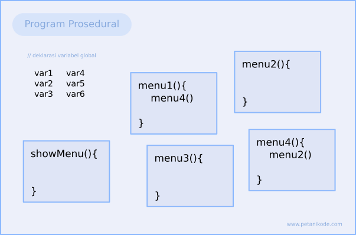
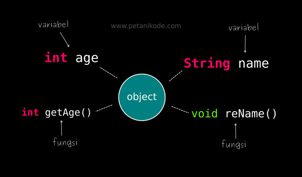
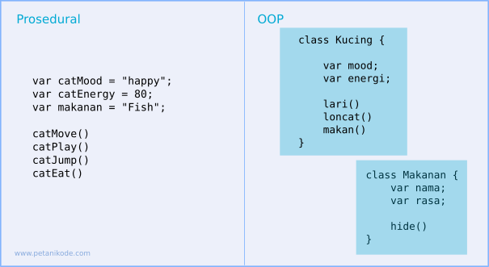
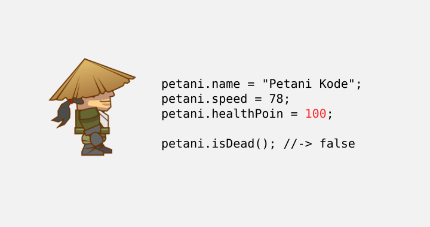
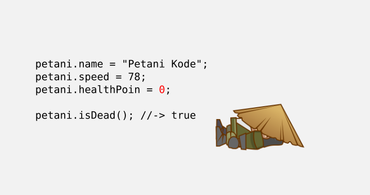
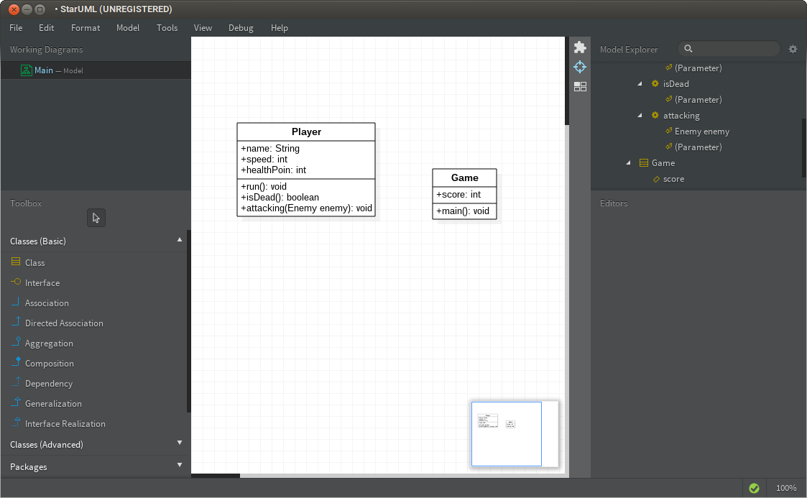
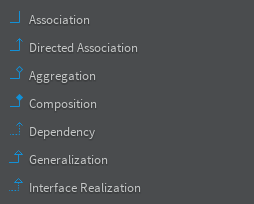

# 1 | Memahami Konsep Dasar OOP


OOP merupakan hal yang harus dipelajari untuk memahami Java lebih dalam. Karena Java sendiri merupakan bahasa yang disesain untuk OOP.

Buktinya, saat kita membuat program paling sederhana, semisal `Hello World`, kita diwajibkan menggunakan _class_:

```java
class Hello {
    public static void main(String[] args){
        System.out.println("Hello World!");
    }
}
```

OOP dikenal sebagai teknik pemrograman modern yang lebih efisien dan banyak digunakan pada _Framework_.

> _"Jika kamu ingin memahami Framework, pelajari dulu konsep OOP"_

Dalam materi kali ini, akan dibahas konsep dasar dari OOP seperti:

1. Mengapa belajar OOP
2. Apa itu OOP
3. Objek dan Class
4. Class Diagram

## 1 | Mengapa Harus Belajar OOP

Pada pemrograman prosedural, biasanya program dipecah menjadi beberapa subprogram dengan fungsi atau prosedur, lalu membuat variabel global dan lokal untuk menyimpan data.



Semakin besar programnya, semakin banyak pula variabl dan prosedur yang harus dibuat. 

Hal ini membuat program menjadi sulit dimodifikasi, dipelihara atau diperluas, karena akan menjadi terlalu kompleks.

Oleh karena itulah, pendekatan OOP menjadi dibutuhkan.

Catatanku:

Well, benar! Aku kira materi tentang OOP itu hanya sekedar materi programming sampingan yang tidak terlalu penting, atau hanya sekedar menghabiskan jam-jam belajar programming untuk hal yang tidak perlu. Tapi ternyata salah!

Setelah beberapa praktik di materi pertama, konsep OOP benar-benar sangat berbeda. Sama sekali berbeda dari konsep prosedural yang selalu aku gunakan di C++ untuk _Competitive Programming_.

OOP itu fleksibel, enak digunakan dimana-mana, modular, mudah diperluas, lebih enak dibaca, mudah mendebug atau menemukan kesalahn dalam kode, mudah dipelihara, dan yang paling jelas, efisensi!

Karena efisien, banyak waktu yang bisa dipangkas untuk membuat projek atau kode program tertetu, sehingga bisa praktik materi dan konsep lain dengan lebih cepat. 

Mungkin materi OOP yang dijelaskan selama kuliah tidak akan terlalu terasa jika sebelumnya tidak terlalu sering menulis program dengan konsep prosedural. Efeknya baru terasa ketika **praktik langsung!** Pendekatan aktif dalam belajar memang krusial disini.

Dan menurutku, bahasa yang paling enak untuk mengenalkan konsep OOP, ya jelas Java. Tidak ada yang lebih enak selain bahasa ini, karena Java _memaksa_ untuk ditulis dengan konsep OOP, sehingga mau tidak mau harus menggunakan OOP.

## 2 | Apa itu OOP?

OOP (_Object Oriented Programming_) atau dalam bahasa Indonesia dikenal dengan Pemrograman Berorientasi Objek(PBO) merupakan sebuah paradigma atau teknik pemrograman yang berorientasi objek.

> Gini aja, bahasa gampang versiku: OOP itu cara menulis program dengan memandang program sebagai kumpulan objek yang saling berinteraksi. Nah, objek ini punya sifat-sifat dan kemampuan tertentu. Misalnya, kursi bisa punya sifat terbuat dari kayu, ada sandaran, ada bantalan; motor punya merek, warna, kecepatan maksimum, dan seterusnya.
>
>Untuk membuat objek, kita pakai class—bayangin class itu seperti cetakan atau blueprint. Class mendefinisikan sifat dan kemampuan yang dimiliki objek. Misalnya, class Kursi mendefinisikan bahwa kursi punya bahan, sandaran, dan bantalan; lalu kita bisa bikin objek nyata kursiRuangTamu dari class itu.
>
>Jadi, pendekatan OOP adalah memikirkan program sebagai kumpulan objek yang punya sifat berbeda-beda dan bisa saling berinteraksi sesuai “aturan” yang ditentukan class-nya.

Pada OOP, fungsi dan variabel dibungkus dalam sebuah **objek** atau **class** yang dapat saling berinteraksi, sehingga membuat sebuah program:



Dengan demikian, tidak akan ada lagi kode yang "berantakan". Semua akan kita bungkus dalam objek, dan pembungkus itu adalah _class.._


## 3 | Class dan Object

Class sebenarnya bertugas untuk mengumpulkan prosedur/fungsi dan variabel dalam satu tempat.

Kita ingin membuat game sederhana, di dalamnya ada kucing dan makanan:



Dengan class, kita bisa menentukan, mana variabel dan prosedur untuk kucing dan makanan. Class ini nanti yang akan kita pakai untuk membuat objek.

Jadi...

"**_Class adalah rancangan atau blue print dari sebuah objek_**."

Sedangkan objek adalah sebuah variabel yang merupakan _instance_, atau perwujudan dari _Class_.

_Instance_ bisa diartikan sebagai wujud dari _class_.

> Nah ini nih bagian yang menarik. Tanpa praktik langsung, bakal dibikin pusing sama penjelasan yang agak rumit ini. Intinya baca teori sambil praktik! Nanti paham sendiri, dan bakal "Ohhhh... gitu!"

_Class_ berisi definisi variabel dan fungsi yang menggambarakan sebuah objek.

Dalam OOP:
- Variabel disebut **atribut** atau **properti**.
- Fungsi disebut **method**.

Contoh _Class_:

```java
class NamaClass {
    String atribut1;
    String atribut2;

    void namaMethod(){ ... }
    void namaMethodLain(){ ... }
}
```
Lalu, kita biasanya membuat objek (_instance_) seperti ini:

```java
NamaClass namaObj = new NamaClass();
```
Kata kunci `new` berfungsi untuk membuat objek baru dari _class_ tertentu.

Setelah membuat objek, kita bisa mengakses atribut dan method dari objek tersebut:

```java
namaObj.namaMethod();
namaObj.atribut1;
```

Tanda titik (`.`) berfungsi untuk mengakses atribut dan method.

## 4 | Contoh Program OOP

Misal kita memiliki kode Java berikut, yaitu `Player.java` seperti ini:

```java
package dasar;

public class Player {
    
    // definisi atribut
    String name;
    int speed;
    int healthPoin;

    // definisi method run
    void run(){
        System.out.println(name +" is running...");
        System.out.println("Speed: "+ speed);
    }

    // definisi method isDead untuk mengecek nilai kesehatan (healthPoin)
    boolean isDead(){
        if(healthPoin <= 0) return true;
        return false;
    }
}
```
Berikutnya, buat _class_ baru lagi bernama `Game.java` dan isi kodenya seperti ini:

```java
package dasar;

public class Game {
    public static void main(String[] args){

        // membuat objek player
        Player petani = new Player();

        // mengisi atribut player
        petani.name = "Petani Kode";
        petani.speed = 78;
        petani.healthPoin = 100;

        // menjalankan method
        petani.run();

        if(petani.isDead()){
            System.out.println("Game Over!");
        }
    }
}
```

Eksekusi program terakhir, maka akan muncul output sepeti ini:

```bash
Petani Kode is running...
Speed: 78
```

Coba ganti nilai `healthPoint` menjadi `0`. Dan setelah itu eksekusi lagi programnya. Outputnya mungkin menjadi seperti ini:

```bash
Petani Kode is running...
Speed: 78
Game Over!
```

Sekarang akan dijelaskan bagaimana proses ini terjadi. Tapi karena terlalu panjang, aku _copy paste_ saja dari webnya langsung penjelasan diatas:


Baik, kita mulai dari pembuatan _class_.

Pertama-tama, kita membuat sebuah _class_ dengan nama `Player`. Class ini mendefinisikan objek Player dalam Game dengan atribut sebagai berikut:

- `name` adalah nama objek;
- `speed` adalah kecepatan;
- `healthPoin` adalah nilai kesehatan dari player, biasanya disingkat `hp`.

Lalu class `Player` memiliki method:

- `run()` untuk menggerakkan player;
- `isDead()` untuk mengecek kondisi kesehatan player. Method ini akan mengembalikan nilai `true` apabila nilai hp lebih kecil atau sama dengan nol (`0`), sebaliknya akan mengembalikan nilai `false`.

Berikutnya kita membuat objek baru dari class `Player` pada class `Game` bernama `petani`.

```java
// membuat objek player
Player petani = new Player();
```

Setelah itu mengisi atribut-atributnya. Karena kalau tidak diisi akan bernilai _Null_ dan bisa menyebabkan _NullPointerException_.



Berikutnya kita coba modifikasi nilai `hp` menjadi nol.

Hasilnya, pesan `Game Over!` akan ditampilkan. Karena method `isDead()` akan mengembalikan nilai `true` jika nilai `hp` kurang atau sama dengan nol.



Sebagai pelengkap akhir, berikut contoh program OOP untuk `Drone`:

```java
class Drone {
    // atribut
    int energi;
    int ketinggian;
    int kecepatan;
    String merek;

    // method
    void terbang(){
        energi--;
        if(energi > 10){
            // terbang berarti nilai ketinggian bertambah
            ketinggian++;
            System.out.println("Dorne terbang...");
        } else {
            System.out.println("Energi lemah: Drone nggak bisa terbang");
        }
    }

    void matikanMesin(){
        if(ketinggian > 0){
            System.out.println("Mesin tidak bisa dimatikan karena sedang terbang");
        } else {
            System.out.println("Mesin dimatikan...");
        }
    }

    void turun(){
        // ketinggian berkurang, karena turun
        ketinggian--;
        energi--;
        System.out.println("Drone turun");
    }

    void belok(){
        energi--;
        System.out.println("Drone belok");
        // belok ke mana? perlu dicek :)
    }

    void maju(){
        energi--;
        System.out.println("Drone maju ke depan");
        kecepatan++;
    }

    void mundur(){
        energi--;
        System.out.println("Drone mundur");
        kecepatan++;
    }
}
```

## 5 | Bagaimana Menentukan Atribut dan Method dari Objek?

Seperti yang sudah dijelaskan diawal. Objek memiliki data (atribut) dan operasi (fungsi).

Kuncinya:

- Atribut itu seperti ciri-ciri dari objek.
- Method itu seperti tingkah laku atau operasi.

Contoh:

Misalkan kita ingin membuat _class_ dari `Senjata`.

Apa ciri-ciri dari senjata atau daya yang bisa dijadikan atribut?
- jumlah peluru
- jenis
- nama senjata
- berat
- warna
- dll

Lalu apa tingkah laku atau operasi (fungsi) yang bisa dilakukan?
- tembak()
- lempar()
- kurangiPeluru()
- reload()


Maka class-nya dibuat seperti ini:

```java
class Senjata {
    // atribut
    String nama;
    int jumlahPeluru;
    
    // method
    void tembak(){
        //..
        // setelah nembak, kurangi peluru
        jumlahPeluru--;
    }

    void reload(){
        //..
        // kalau di-reload maka jumlah peluru diisi ulang
        jumlahPeluru = 300;
    }
}
```

Mudah bukan...

## 6 | Mengenal Class Diagram

_Class Diagram_ adalah sebuah diagram yang menggambarkan hubungan antar _class_. _Class Diagram_ dapat kita buat dengan aplikasi perancangan (CASE), seperti StarUML.



Sebuah _class_ digambarkan dengan sebuah table 1 kolom dan 3 baris.

Baris pertama berisi nama _class_, baris kedua berisi atribut, dan baris ketiga berisi method.


Selain itu, terdapat garis yang menggambarkan hubungan antara _class_:



_Class Diagram_ biasanya digunakan oleh _Software Engineer_ untuk merancang software dengan paradigma OOP.

Sebagai programmer, kita hanya perlu tahu cara membaca dan menuliskannya ke dalam kode.

Jika kamu tertarik dengan class diagram, bisa membaca buku-buku tentang UML.