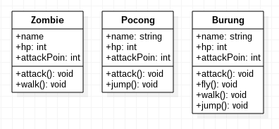
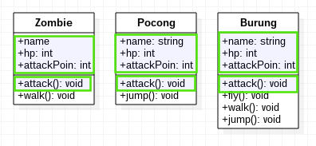
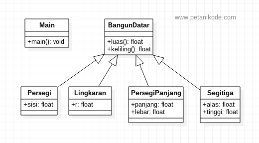
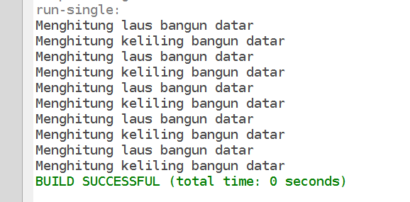
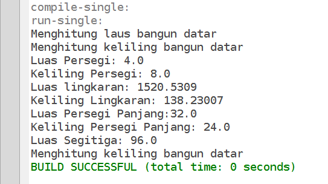

# 2 | Memahami Inheritance dan Method Overriding


Seperti yang sudah kita pelajari sebelumnya: sebuah class atau objek bisa saling berhubungan dengan class yang lain.

Salah satu bentuk hubunganya adalah _inheritance_ (pewarisan). Hubungan ini seperti hubungan keluarga antara orang tua dan anak.

Sebuah class di Java, bisa memiliki satu atau lebih keturunan atau class anak (_sub class_). Class anak akan memiliki warisan properti dan method dari class ibu (_parent class / super class_).

Pada materi kali ini kita akan belajar:
1. Kenapa kita harus menggunakan _inheritance_
2. Contoh program _inheritance_
3. Method Overriding

## 1 | Kenapa Menggunakan Inheritance

Misalkan dalam Game, kita akan membuat class-class musuh dengan perilaku yang berbeda:



Lalu kita membuat kode untuk masing-masing class seperti ini:

File: `Zombie.java`
```java
class Zombie {
    String name;
    int hp;
    int attackPoin;

    void attack(){
        // ...
    }

    void walk(){
        //...
    }
}
```

File: `Pocong.java`
```java
class Pocong {
    String name;
    int hp;
    int attackPoin;

    void attack(){
        // ...
    }

    void jump(){
        //...
    }
}
```

File: `Burung.java`
```java
class Burung {
    String name;
    int hp;
    int attackPoin;

    void attack(){
        // ...
    }

    void walk(){
        //...
    }

    void jump(){
        //...
    }

    void fly(){
        //...
    }
}
```

Apakah boleh seperti ini?

Ya, boleh-boleh saja. Akan Tapi tidak efektif, karena kita menulis berulang-ulang properti dan method yang sama.

Oleh karena itu, solusinya adalah dengan menggunakan _inheritance_. Mari kita lihat member class yang sama:



Setelah menggunakan _inheritance_, maka akan menjadi seperti ini:


Oya, _inheritance_ di StarUML digambarkan dengan garis hubung _Generalization_.

Class _Enemy_ adalah class induk yang memiliki anak `Zombie`, `Pocong`, dan `Burung`. Apapun properti yang ada di class induk, akan dimiliki juga oleh class anak.

Lalu bagaimana bentuk kodenya dalam Java?

Bentuk kodenya akan seperti ini:

File: `Enemy.java`

```java
class Enemy {
    String name;
    int hp;
    int attackPoin;

    void attack(){
        System.out.println("Serang!");
    }
}
```

Pada class anak, kita menggunakan kata kunci `extends` untuk menyatakan kalau dia adalah class turunan dari `Enemy`.

File: `Zombie.java`

```java
class Zombie extends Enemy {
    void walk(){
        System.out.println("Zombie jalan-jalan");
    }
}
```

File: `Pocong.java`

```java
class Pocong extends Enemy {
    void jump(){
        System.out.println("loncat-loncat!");
    }
}
```

File: `Burung.java`

```java
class Burung extends Enemy {
    void walk(){
        System.out.println("Burung berjalan");
    }
    void jump(){
        System.out.println("Burung loncat-loncat");
    }
    void fly(){
        System.out.println("Burung Terbang...");
    }
}
```

Lalu, bila kita ingin membuat objek dari class-class tersebut, kita bisa membuatnya seperti ini:

```java
Enemy monster = new Enemy();
Zombie zumbi = new Zombie();
Pocong hantuPocong = new Pocong();
Burung garuda = new Burung();
```

## 2 | Contoh Program Inheritance

Sekarang mari kita buat contoh program sederahan. Program yang akan kita buat akan berfungsi untuk menghitung luas dan keliling bangun datar. Bentuk class diagramnya seperti ini:



Buatlah class-class baru berdasarkan diagram di atas.

File: `inheritance/BangunDatar.java`

```java
package inheritance;

public class BangunDatar {

    float luas(){
        System.out.println("Menghitung luas bangun datar");
        return 0;
    }
    
    float keliling(){
        System.out.println("Menghitung keliling bangun datar");
        return 0;
    }
}
```

File: `inheritance/Persegi.java`

```java
package inheritance;

public class Persegi extends BangunDatar {
float sisi;   
}
```

File: `inheritance/Lingkaran.java`

```java
package inheritance;

public class Lingkaran extends BangunDatar{

    // jari-jari lingkaran
    float r;

}
```

File: `inheritance/PersegiPanjang.java`

```java
package inheritance;

public class PersegiPanjang extends BangunDatar {
float panjang;
float lebar;
}
```

File: `inheritance/Segitiga.java`

```java
package inheritance;

public class Segitiga extends BangunDatar {

    float alas;
    float tinggi;

}
```

File: `inheritance/Main.java`

```java
package inheritance;

public class Main {
public static void main(String[] args) {

        // membuat objek bangun datar
        BangunDatar bangunDatar = new BangunDatar();
        
        // membuat objek persegi dan mengisi nilai properti
        Persegi persegi = new Persegi();
        persegi.sisi = 2;
        
        // membuat objek Lingkaran dan mengisi nilai properti
        Lingkaran lingkaran = new Lingkaran();
        lingkaran.r = 22;
        
        // membuat objek Persegi Panjang dan mengisi nilai properti
        PersegiPanjang persegiPanjang = new PersegiPanjang();
        persegiPanjang.panjang = 8;
        persegiPanjang.lebar = 4;
        
        // membuat objek Segitiga dan mengisi nilai properti
        Segitiga mSegitiga = new Segitiga();
        mSegitiga.alas = 12;
        mSegitiga.tinggi = 8;
        
        
        // memanggil method luas dan keliling
        bangunDatar.luas();
        bangunDatar.keliling();
        
        persegi.luas();
        persegi.keliling();
        
        lingkaran.luas();
        lingkaran.keliling();
        
        persegiPanjang.luas();
        persegiPanjang.keliling();
        
        mSegitiga.luas();
        mSegitiga.keliling();
    }
}
```

Setelah itu, coba jalankan class `Main`, maka hasilnya:



Kenapa hasilnya bisa begitu?

Karena yang kita panggil sebenarnya adalah method `luas()` dan `keliling()` milik si induk (`BangunDatar`).

Objek anak dari `BangunDatar` belum memiliki method `luas()` dan `keliling()`, akhirnya mengambil milik induknya.

Lalu bagaimana kalau kita ingin membuat agar semua class anak memiliki method `luas()` dan keliling yang berbeda dari induk?

Jawabanya, adalah dengan menggunakan _method overriding_.

## 3 | Method Overriding

Method Overriding dilakukan saat kita ingin membuat ulang sebuah method pada sub-class atau class anak.

Method Overriding dapat dibuat dengan menambahkan anotasi `@Override` diatas nama method atau sebelum pembuatan method.

Contoh: `Persegi.java`

```java
class Persegi extends BangunDatar {
    float sisi;

    @Override
    float luas(){
        float luas = sisi * sisi;
        System.out.println("Luas Persegi: " + luas);
        return luas;
    }

    @Override
    float keliling(){
        float keliling = 4 * sisi;
        System.out.println("Keliling Persegi: " + keliling);
        return keliling;
    }
}
```

Artinya kita menulis ulang method `luas()` dan `keliling()` di class anak.

Sekarang mari kita buat _method overriding_ untuk semua class anak.

File: `Lingkaran.java`

```java
package inheritance;

public class Lingkaran extends BangunDatar{
    
    // jari-jari lingkaran
    float r;
    
    @Override
    float luas(){
        float luas = (float) (Math.PI * r * r);
        System.out.println("Luas lingkaran: " + luas);
        return luas;
    }
    
    @Override
    float keliling(){
        float keliling = (float) (2 * Math.PI * r);
        System.out.println("Keliling Lingkaran: " + keliling);
        return keliling;
    }
}
```

Dalam rumus luas dan keliling lingkaran, kita bisa memanfaatkan konstanta `Math.PI` sebagai nilai `PI`. Konstanta ini sudah ada di Java.

File: `PersegiPanjang.java`

```java
package inheritance;

public class PersegiPanjang extends BangunDatar {
    float panjang;
    float lebar;
    
    @Override
    float luas(){
        float luas = panjang * lebar;
        System.out.println("Luas Persegi Panjang:" + luas);
        return luas;
    }
    
    @Override
    float keliling(){
        float kll = 2*panjang + 2*lebar;
        System.out.println("Keliling Persegi Panjang: " + kll);
        return kll;
    }
}
```

File: `Segitiga.java`

```java
package inheritance;

public class Segitiga extends BangunDatar {
    
    float alas;
    float tinggi;

    @Override
    float luas() {
        float luas = 1/2 * (alas * tinggi);
        System.out.println("Luas Segitiga: " + luas);
        return luas;
    }
}
```
Untuk class `Segitiga`, kita hanya melakukan _override_ terhadap method `luas()` saja. Karena untuk method `keliling()`, segitiga memiliki rumus yang berbeda-beda.

…atau mungkin bisa diturunkan lagi class segitiga ini menjadi: `SegitigaSiku`, `SegitigaSamaKaki`, `SegitigaSamaSisi`, dsb.

Sekarang mari kita coba eksekusi class `Main` lagi:



Tunggu dulu!

Tadi di awal katanya tidak efisien menulis berulang-ulang, lah ini?

Iya di awal kita menulis atribut dari `Enemy` yang sama berulang-ulang. Berbeda dengan yang ini, kita memang menulis method yang sama. Tapi isi atau rumus di dalam method-nya berbeda-beda.

Ini nanti akan kita bahas dalam Polimorfisme (banyak bentuk).