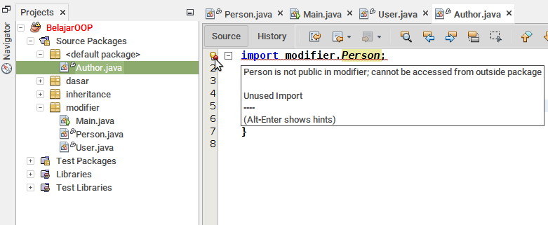
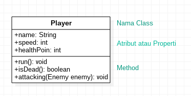
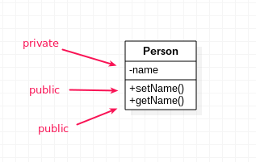
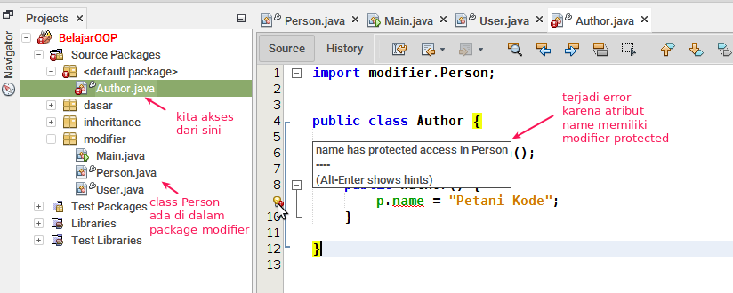
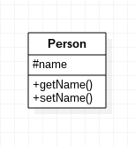

# 3 | Memahami Tingkatan Akses Member dan Class (Modifier)


Class dalam program Java dapat saling berhubungan dengan cara memberikan akses terhadap member mereka. Salah satu hubungan class yang pernah dipelajari, salah satunya adalah _inheritance_.

Semua yang ada didalam _class_ (atribut dan method) disebut member. Biasanya akan ada tingaktan akses yang disebut modifier. Pada hubungan _inheritance_, semua member di dalam class induk akan bisa diakses oleh class anak (sub-class), kecuali member tersebut diberikan modifier _private_.

Perlu diingat: 

Modifier tidak hanya bisa diberikan kepada member saja. Tapi juga bisa diberikan kepada interface, enum, dan class itu sendiri.

Perhatikan kode berikut:

```java
pcakage modifier;

public class User extends Person {
    private String username;
    private String password;
    
    @Override
    public String getName(){
        return this.name;
    }
}
```

Yang saya garis bawahi pada kode diatas adalah modifier. Modifier ini nanti akan menentukan batasan akses member dan class.

## 1 | Ada 3 Macam Modifier dalam Java

Secara umum ada 3 macam modifier yang digunakan dalam Java: `public`, `private`, dan `protected`.

Apabila kita tidak menggunakan tiga kata kunci tersebut, maka member atau class itu tidak menggunakan modifier (_no modifier_). Masing-masing modifier akan menentukan dimana saja member bisa diakses.

Berikut ini table jangkauan untuk masing-masing modifier:


| Modifier    | Class | Package | Subclass | World |
|-------------|------|---------|----------|-------|
| public      | ✅    | ✅ | ✅ | ✅ |
| protected   | ✅    | ✅ | ✅ | ❌ |
| no modifier | ✅ | ✅ | ❌ | ❌ |
| private | ✅ | ❌ | ❌ | ❌ |

- ✅ artinya bisa diakses
- ❌ artinya tidak bisa diakses
- `Subclass` artinya class anak
- `World` artinya seluruh package di aplikasi

Pada table diatas... apabila kita tidak menggunakan modifier (_no modifier_), maka class dan membernya hanya akan bisa diakses dari Class itu sendiri dan package (class yang berada satu package denganya).

Agar bisa diakses dari mana saja, maka kita harus memberikan modifier `public`.

Mari kita lihat contohnya:

## 2 | Public
 Modifier `public` akan membuat member dan class bisa diakses dari mana saja, contoh:
 
```java
package modifier;

class Person {
    public String name;

    public changeName(String newName){
        this.name = newName;
    }
}
```

Pada class `Person` terdapat dua membe, yaitu:
1. atribut `name`
2. method `changeName()`

Kedua member tersebut kita berikan modifier `public`. Artinya mereka akan bisa diakses dari mana saja.

Namun, class `Person` tidak kita berikan modifier. Maka yang akan terjadi adalah class tersebut tidak akan bisa diimpor (diakses) dari luar package:



Class `Person` berada di dalam package `modifier`, lalu kita coba akses dari _default_ package, maka yang akan terjadi adalah error seperti gambar di atas.

Bagaimana solusinya agar bisa diakses dari luar package?

Ya kita harus menambahkan modifier `public` ke dalam class `Person`:

```java
package modifier;

public class Person {
    public String name;

    public changeName(String newName){
        this.name = newName;
    }
}
```
Maka error akan menghilang dan class 1 akan bisa diimpor dari package manapun.

Pada class diagram, modifier `public` digambarkan dengan simbol plus (`+`).

Contoh:



Semua member dalam class `Player` memiliki modifier `public`. Perhatikan simbol `+` yang ada di depanya.

## 3 | Private

Modifier `private` akan membuat member hanya bisa diakses oleh dari dalam class itu sendiri.

Perlu diingat:

Modifier `private` tidak bisa diberikan kepada class, enum, dan interface. Modifier `private` hanya bisa diberikan kepada member class.

Contoh:

```java
class Person {
    private String name;

    public void setName(String name){
        this.name = name;
    }

    public String getName(){
        return this.name;
    }
}
```

Pada contoh di atas, kita memberikan modifier `private` pada atribut `name` dan modifier `public` pada method `setName()` dan `getName()`.

Apabila kita coba mengakses langsung atribut name seperti ini:

```java
Person mPerson = new Person()
mPerson.name = "Petani Kode"; // <- maka akan terjadi error di sini
```

Lalu bagaimana cara mengakses member `private` dari luar class?

Kita bisa memanfaatkan method **setter** dan **getter**. Karena, method ini akan selalu diberikan modifier `public`.

Contoh:

```java
Person mPerson = new Person();
mPerson.setName("Petani Kode");

System.out.println("Person Name: " + mPerson.getName());
```

Pada class diagram, modifier `private` digambarkan dengan simbol minus (`-`).



## 4 | Protected

Modifier `protected` akan membuat member dan class hanya bisa diakses dari:

1. Class itu sendiri;
2. Sub class atau class anak;
3. Package (class yang berada satu package dengannya).

Modifier protected juga hanya boleh digunakan pada member saja.

Contoh:

```java
package modifier;

public class Person {
    protected String name;
    
    public void setName(String name){
        this.name = name;
    }
    
    public String getName(){
        return this.name;
    }
}
```

Pada contoh di atas, kita memberikan modifier `protected` pada atribut `name`.

Apabila kita coba mengakses dari class yang satu package dengannya, maka tidak akan terjadi error.

Namun, apabila kita mencoba mengakses dari luar package seperti ini:

```java
import modifier.Person;

public class Author {
    
    Person p = new Person();

    public Author() {
        // akan terjadi error di sini karena atribut name 
        // telah diberikan modifier protected
        p.name = "Petani Kode";
    }
    
}
```
Maka akan terjadi error.



Pada class diagram (di StarUML), modifier `protected` digambarkan dengan tanda pagar (`#`).

