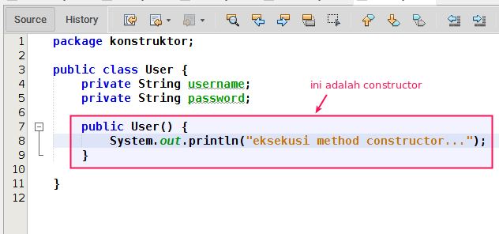
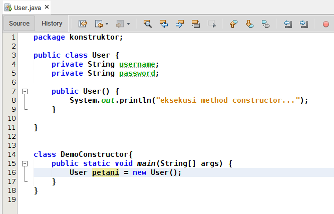
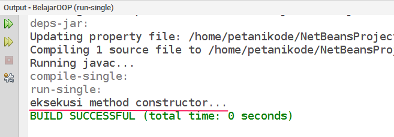
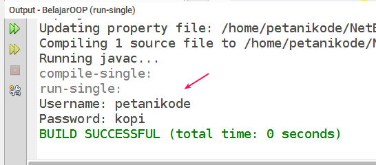

# 4 | Mengenal Constructor dan Destructor dalam Java


## 1 | Apa itu Constructor

Constructor adalah method khusus yang akan dieksekusi pada saat pembuatan objek (_instance_). Biasanya method ini digunakan untuk inisialisasi atau mempersiapkan data untuk objek.

berikut ini contoh constructor:



Cara membuat constructor adalah dengan menuliskan nama method constructor sama seperti nama class. Pada contoh diatas constructor ditulis seperti ini:

```java
public User() {
    System.out.println("eksekusi method constructor...");
}
```
Pastikan memberikan modifier `public` kepada Constructor, karena ia akan dieksekusi saat pembuatan objek (_instance_).

Mari kita coba membuat objek baru dari class _User_:

```java
User petani = new User();
```

Sehingga sekarang kita punya kode lengkap seperti ini:



Hasilnya saat dieksekusi:



## 2 | Constructor dengan Parameter

Constructor biasanya digunakan untuk _initialize_ (menyiapkan) data untuk class.

Untuk melakukan ini, kita harus membuat parameter sebagai inputan untuk constructor.

Contoh:

```java
public class User {
    public String username;
    public String password;

    public User(String username, String password){
        this.username = username;
        this.password = password;
    }
}
```

Pada kode class `User` di atas, kita menambahkan parameter `username` dan `password` ke dalam constructor.

Berarti nanti saat kita membuat objek, kita harus menambahkan nilai parameter seperti ini:

```java
User petani = new User("petanikode", "kopi");
```

Contoh kode lengkapnya adalah seperti ini:

```java
package konstruktor;

public class User {
    public String username;
    public String password;
    
    public User(String username, String password){
        this.username = username;
        this.password = password;
    }
       
}


class DemoConstructor{
    public static void main(String[] args) {
        User petani = new User("petanikode", "kopi");
        System.out.println("Username: " + petani.username);
        System.out.println("Password: " + petani.password);
    }
}
```

Hasil outputnya:



## 3 | Desctructor dalam Java

Destructor adalah method khusus yang akan dieksekusi saat objek dihapus dari memori.

Java sendiri tidak memiliki method destructor, karena Java menggunakan _garbage collector_ untuk manajemen memorinya.

Jadi Si _garbage collector_ akan otomatis menghapus objek yang tidak terpakai.

Sementara untuk bahasa pemrograman lain, seperti C++ kita bisa membuat destructor sendiri seperti ini:

```cpp
class User {  
public:  
   User( String *username );  // <-- ini constructor  
   ~User(); //  <-- ini destructor.  
private:  
   String username;  
   String password;  
}; 
```

> …Intinya constructor adalah sebuah method. Method yang akan dieksekusi saat pembuatan objek.
>Sementara untuk destructor adalah kebalikan dari constructor dan Java tidak memiliki destructor karena menggunakan metode garbage collector.