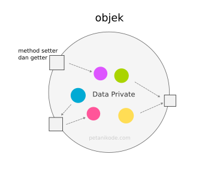
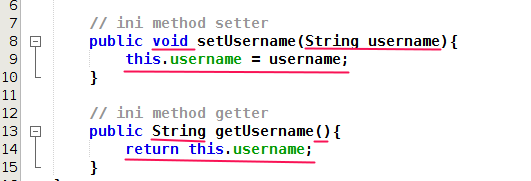
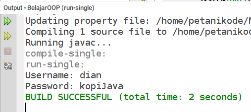

# 5 | Menggunakan Method Setter dan Getter untuk Enkapsulasi


Method setter dan getter adalah dua method yang tugasnya untuk mengambil dan mengisi data ke dalam objek.

Dalam OOP kita sering mendengar istilah _encapsulation_ (pembungkusan), di mana data dibungkus dengan modifier _private_ agar tidak bisa diakses secara langsung dari luar class.



Nah method setter dan getter inilah yang akan membantu kita mengakses data tersebut.

Apa alasan harus dibuat seperti ini? Ada beberapa alasan:
1. Untuk meningkatkan keamanan data
2. Agar lebih mudah dalam mengontrol atribut dan method
3. Class bisa kita buat menjadi _read-only_ dan _write-only_
4. dan fleksibel, programmer dapat mengganti sebagian dari kode tanpa harus takut berdampak pada kode yang lain.

## 1 | Cara Membuat Method Setter dan Getter

Cara membuat method setter dan getter sama saja seperti membuat method biasa.

Contoh:

```java
class User {
    private String username;
    private String password;

    // ini method setter
    public void setUsername(String username){
        this.username = username;
    }

    public void setPassword(String password){
        this.password = password;
    }

    // ini method getter
    public String getUsername(){
        return this.username;
    }

    public String getPassword(){
        return this.password;
    }
}
```

Method setter dan getter harus diberikan modifier `public`, karena method ini akan diakses dari luar class.

Perbedaan method setter dengan getter terletak pada nilai kembalian, parameter, dan isi method-nya.

Method setter tidak memiliki nilai kembalian `void` (kosong). Karena tugasnya hanya untuk mengisi data ke dalam atribut.

Sedangkan method getter memiliki nilai kembalian sesuai dengan tipe data yang akan diambil.



Nama method setter dan getter harus diawali dengan `set` untuk setter dan `get` untuk getter.

Apa boleh menggunakan bahasa indonesia? misalnya `isi` untuk setter dan `ambil` untuk getter.

Boleh-boleh saja, tapi ini tidak dianjurkan. Karena jika kita bekerja dengan tim, tim yang lain akan kesulitan. Apalagi dalam tim tersebut menggunakan bahasa inggris.

## 2 | Menggunakan Method Setter dan Getter

Setelah kita membuat method setter dan getter, kita bisa mengakses atau menggunakannya seperti method biasa.

Contoh:

```java
// Kode ini ditulis di dalam method main

// membuat objek dari class User
User dian = new User();

// menggunakan method setter
dian.setUsername("dian");
dian.setPassword("kopiJava");

// menggunakan method getter
System.out.println("Username: " + dian.getUsername());
System.out.println("Password: " + dian.getPassword()); 
```

Hasil output:



## 3 | Trik Cepat

Pada Netbens ada cara cepat untuk membuat setter dan getter, yaitu `Alt + insert`, dan pada menu `Generate`, pilih opsi `Getter and Setter`. Lalu pilih atribut apa saja yang ingin dibuatkan method setter dan getter-nya.

Pada Intellij, shortcutnya juga sama, atau bisa dikatakan caranya juga sama. Bisa generate setter dan getter otomatis.