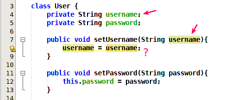
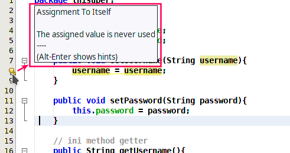
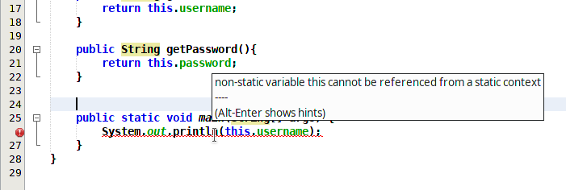
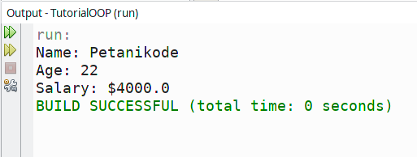
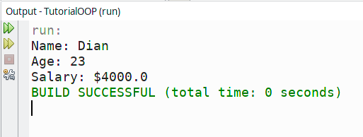

# 6 | Apa fungsi 'this' dan 'super' pada Java?


Kata kunci `this` dan `super` sering muncul dalam program Java.

Apa sih fungsinya?

Pada materi kali ini, kita akan membahas 2 syntax ini, tapi pastikan sudah belajar _inheritance_ sebelumnya.

Jika sudah, mari kita lanjut...

## 1 | Fungsi `this` pada Java

Pada tutorial sebelumnya, kita sudah belajar tentang method _setter_ dan _getter_.

Di sana kita menggunakan kata kunci this untuk mengisi variabel.

Contoh: 

```java
class User {
    private String username;
    private String password;

    // ini method setter
    public void setUsername(String username){
        this.username = username;
    }

    public void setPassword(String password){
        this.password = password;
    }

    // ini method getter
    public String getUsername(){
        return this.username;
    }

    public String getPassword(){
        return this.password;
    }
}
```

Lihat! _this_ kita gunakan di setiap method.

Coba perhatikan salah satu method:

```java
public void setUsername(String username){
    this.username = username;
}
```

Bagaimana kalau kita hapus `this` pada method ini?

```java
public void setUsername(String username){
    username = username;
}
```

Apa yang akan terjadi?

Yak! komputer akan bingung…

Karena tidak tahu variabel `username` yang mana yang dimaksud.

Apakah variabel yang di class (`private String username`) ataukah variabel `username` yang ada di dalam parameter.



Jika kita sentuh balon peringatan di samping, maka kita akan mendapatkan pesan: **_“Assignment To Itself”_**.



Ini artinya variabel tersebut mengisi dirinya sendiri.

Karena itu, kita harus menggunakan `this` untuk menyatakan variabel yang dimaksud adalah variabel yang ada di dalam class.

```java
public void setUsername(String username){
    this.username = username;
}
```

Jadi…

Kata kunci `this` digunakan sebagai referensi dari class itu sendiri.

Masih bingung?

Oke, kalau begitu… setiap menemukan `this` coba gunakan pandangan ini:

> _`this` artinya class itu sendiri._

Misalnya ada class lagi:

```java
class Person {
    private String name;

    public void setName(String name){
        this.name = name;
    }
}
```

Maka `this` yang dimaksud pada class tersebut adalah class `Person`.

Apakah kita bisa menggunakan `this` di luar class?

Tidak.

`this` hanya bisa digunakan di dalam class saja.

Coba saja buat fungsi `main()` lalu gunakan `this` di sana. Maka yang akan terjadi adalah…



Yak! programnya akan error.

Karena variabel yang kita coba akses dari `main()` adalah variabel yang non-statis.

…dan `this` tidak bisa digunakan pada `main()`.

## 2 | Fungsi `super` pada Java

Jika `this` merepresentasikan objek dari class itu sendiri, maka `super` akan merepresentasikan objek dari class induk.

Perhatikan contoh ini:

Kita mencoba membuat class `Person` yang akan menjadi class induk atau super class.

```java
public class Person {
    String name = "Petani Kode";
    int age = 22;
}
```

Lalu, kita buat class turunannya (sub class), yaitu: class `Employee`.

```java
public class Employee extends Person {
    
    float salary = 4000f;
    String name = "Dian";
    int age = 23;
      
    public void showInfo(){
        System.out.println("Name: " + super.name);
        System.out.println("Age: " + super.age);
        System.out.println("Salary: $" + salary);
    }
}
```
Berikutnya kita membuat class `Demo` untuk membuat objek dan method `main()`.

```java
public class Demo {
    public static void main(String[] args) {
        Employee dian = new Employee("Dian", 23, 4000f);
        
        dian.showInfo();
    }
}
```
Sekarang coba eksekusi class `Demo`, apa hasil outputnya?



Mengapa hasil outputnya begini?

Karena pada method `showInfo()` kita menggunakan kata kunci `super` untuk mengambil nilai dari variabel yang ada di dalam class induk (_super class_).

```java
public void showInfo(){
    System.out.println("Name: " + super.name);
    System.out.println("Age: " + super.age);
    System.out.println("Salary: $" + salary);
}
```

Coba ganti `super` menjadi `this`…

```java
public void showInfo(){
    System.out.println("Name: " + this.name);
    System.out.println("Age: " + this.age);
    System.out.println("Salary: $" + salary);
}
```

…maka hasil outputnya akan seperti ini.



Nilai yang diambil adalah nilai yang dari class `Employee`, karena `this` mewakili class `Employee` sedangkan `super` mewakili kelas induknya, yaitu: `Person`.

Pada kasus ini, kita menggunakan `super` sebagai sebuah objek untuk mengambil nilai.

Kata kunci `super()` juga dapat digunakan untuk memanggil method tertentu dari kelas induk.

Contoh:

```java
// mengeksekusi konstruktor induk
super();

// mengeksekusi sebuah method dari class induk
super.namaMethod();
```

Mari kita coba…

Kita ubah class `Person` menjadi seperti ini:

```java
public class Person {

    public Person() {
        System.out.println("Eksekusi konstruktor Person()");
    }
    
    public void showMessage(){
        System.out.println("Hello, ini pesan dari class Person...");
    }
}
```

Kemudian class `Employee` kita ubah menjadi seperti ini:

```java
public class Employee extends Person {

    public Employee() {
        // eksekusi konstruktor induk
        super();
        
        System.out.println("Ekekusi konstruktor Employee()");
    }
    
    public void info(){
        super.showMessage();
    }
}
```

Lalu di class `Demo`, kita ubah menjadi seperti ini:

```java
public class Demo {
    public static void main(String[] args) {
        Employee dian = new Employee();
        
        dian.info();
    }
}
```

Sekarang coba eksekusi class `Demo`, maka hasil outputnya akan seperti ini:


Perhatikan class `Employee`, pada konstruktornya kita mengeksekusi konstruktor induk dengan `super()`.

Lalu, pada method `info()`, kita mengeksekusi method `showMessage()` dari induk dengan `super.showMessage()`.

Maka hasilnya, akan seperti di atas.

## 3 | Bagaimana Penerapan `this` dan `super` pada Dunia Nyata?

Contoh-contoh di atas mungkin terdengar abstrak, karena tidak mungkin kita membuat program seperti itu di dunia nyata.

Baik, kita akan coba melihat beberapa contoh program di dunia nyata yang menggunakan `this` dan `super`.

Pertama, coba perhatikan program untuk membuat GUI berikut:

```java
import javax.swing.JFrame;

public class MainWindow extends JFrame {

    public MainWindow(){
        this.setTitle("Jendela Utama");
        this.setSize(600,320);
    }
    
    public static void main(String[] args) {
        MainWindow mWindow = new MainWindow();
        mWindow.setVisible(true);
    }
}  
```

Pada program tersebut, kita membuat class `MainWindow` dengan meng-extends dari class `JFrame`.

Pada program ini, `this` digunakan untuk mewakili class `MainWindow` di dalam konstruktornya.

```java
public MainWindow(){
    this.setTitle("Jendela Utama");
    this.setSize(600,320);
}
```

Method `setTitle()` dan `setSize()` didapatkan dari class Induk (`JFrame`). Karena kita meng-extends dari sana.

Mengapa tidak menggunakan `super`?

Karena yang ingin kita ubah `title` dan `size`-nya adalah class `MainWindow`, bukan class `JFrame`.

Kedua, coba perhatikan class `MainActivity` pada Android.

```java
public class MainActivity extends AppCompatActivity {

    @Override
    protected void onCreate(Bundle savedInstanceState) {
        super.onCreate(savedInstanceState);
        setContentView(R.layout.activity_main);

        Toast.makeText(this, "Activity: onCreate()", Toast.LENGTH_SHORT).show();
    }
}
```

Perhatikan…

Pada class `MainActivity`, kita menggunakan `super` untuk memanggil method `onCreate()` dari class induk (`AppCompatActivity`).

```java
super.onCreate(savedInstanceState);
```

Kemudian kita gunakan `this` pada `Toast.makeText()`. `this` pada kasus ini akan mewakili class `MainActivity`.

Masih banyak lagi contoh-contoh penggunaan `this` dan `super` pada dunia nyata.