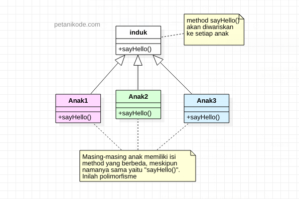
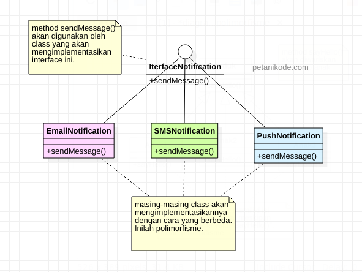
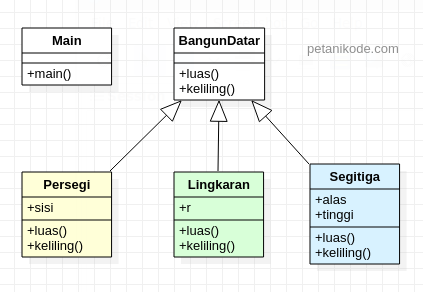
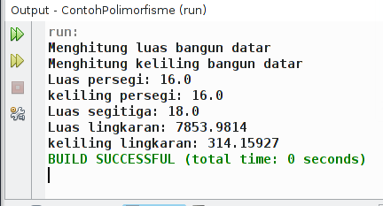

# 7 | Memahami Prinsip Polimorfisme


Pemrograman berorientasikan objek atau OOP, memiliki beberapa pilar atau konsep penting yang harus dipahami.

Di antaranya ada: Class, Objek, Enkapsulasi, Inheritance, dan lainnya.

Pada tutorial sebelumnya, kita sudah belajar banyak hal, namun masih kurang satu. Yaitu adalah polimorfisme.

Apa itu polimorfisme dan bagaimana contohnya? Mari kita bahas:

## 1 | Apa itu Polimorfisme?

_Poly_ artinya banyak, _morfisme_ artinya bentuk.

Polimorfisme (bahasa inggris _polymorphism_) adalah sebuah prinsip dalam biologi di mana oraganisme atau spesies dapat memiliki banyak bentuk atau tahapan (stages). 1

Prinsip ini juga diadopsi pada pemrograman berorientasikan objek.

Sehingga kita dapat definisikan sebagai berikut:

Polimorfisme dalam OOP adalah sebuah prinsip di mana class dapat memiliki banyak “bentuk” method yang berbeda-beda meskipun namanya sama.

“Bentuk” di sini dapat kita artikan: isinya berbeda, parameternya berbeda, dan tipe datanya berbeda.

Polimorfisme pada Java ada dua macam:

- Static Polymorphism (Polimorfisme statis);
- Dynamic Polymorphism (Polimorfisme dinamis).

Beda dari keduanya terletak pada cara membuat polimorfismenya.

Polimorfisme statis menggunakan **method overloading** sedangkan polimorfisme dinamis menggunakan **method overriding**.

Karena kamu baru mendengar kedua hal ini, mari kita bahas perbedaannya lebih detail:

## 2 | Perbedaan Method Overloading dengan Method Overriding

Method overloading terjadi pada sebuah class yang memiliki nama method yang sama tapi memiliki parameter dan tipe data yang berbeda.

Kata kunci yang perlu kamu ingat:

“Dalam satu class”

“Nama method sama”

“Tipe data dan parameter beda”

Itulah method **Overloading**.

Contohnya gimana?

Contohnya misalkan kita memiliki class `Lingkaran.java`. Pada class ini terdapat method `luas()`.

Nah, si method `luas()` ini bisa saja memiliki parameter yang berbeda.

Misalnya kita ingin menghitung luas berdasarkan jari-jari (radius) atau diameter.

Maka kita dapat membuat class-nya seperti ini:

```java
class Lingkaran {

    // method menghitung luas dengan jari-jari
    float luas(float r){
        return (float) (Math.PI * r * r);
    }

    // method menghitung luas dengan diameter
    double luas(double d){
        return (double) (1/4 * Math.PI * d);
    }
}
```

Coba perhatikan!

Class `Lingkaran` memiliki dua method yang namanya sama, yakni `luas()`.

Tapi parameter dan tipe datanya berbeda..

..dan juga isi atau rumus di dalamnya berbeda.

Inilah yang disebut polimorfisme statis.

Sudah paham ‘kan?

Lalu Polimorfisme yang dinamis gimanaa?

Polimorfisme dinamis biasanya terjadi saat kita menggunakan pewarisan (inheritance) dan implementasi _interface_.

Seperti yang sudah kita ketahui:

Pada pewarisan, kita bisa mewariskan atribut dan method dari class induk ke class anak.

Class anak akan memiliki nama method yang sama dengan class induk dan anak yang lainnya.

Nah! Di sinilah akan terjadi polimorfisme.



Class anak akan memiliki nama method yang sama, tapi nanti isi dan parameternya bisa berbeda dari class induk.

Karena si class anak melakukan method _overriding_ (menindih method) yang diwariskannya.

Polimorfisme dinamis juga bisa terjadi saat menggunakan _interface_.



Oh iya, buat kamu yang belum tahu _interface_..

>Interface adalah class kosong yang berisi nama-nama method yang nanti harus diimplementasikan pada class lain. Dalam pengimplementasiannya bisa saja tiap-tiap class akan mengimplementasikan secara berbeda dengan nama method yang sama.

Nah! kelihatan kan bedanya?

Jadi polimorfisme statis hanya terjadi dalam satu class saja.

Sedangkan polimorfisme dinamis terjadi pada saat ada hubungan dengan class lain seperti _inheritance_.

Oke sekarang mari kita lihat contohnya:

## 3 | Contoh Program Polimorfisme Dinamis

Contoh program polimorfisme dinamis sebenarnya sudah pernah kita buat pada pembahasan inheritance.

Kita coba bahas lagi ya…

Perhatikan diagram ini:



Pada diagram tersebut, terdapat class `BangunDatar` yang memiliki tiga subclass, yaitu: `Persegi`, `Lingkaran`, dan `Segitiga`.

Setiap class memiliki method yang sama yaitu `luas()` dan `keliling()`. Akan tetapi method-method ini memiliki isi rumus yang berbeda.

Buatlah class baru dengan nama `BangunDatar`, kemudian isi dengan kode berikut:

```java
package bangundatar;

public class BangunDatar {
    float luas(){
        System.out.println("Menghitung luas bangun datar");
        return 0;
    }
    
    float keliling(){
        System.out.println("Menghitung keliling bangun datar");
        return 0;
    }
}
```

Berikutnya buat class lagi dengan nama `Persegi` dan isi kodenya seperti ini:

```java
package bangundatar;

public class Persegi extends BangunDatar{
    int sisi;
    
    public Persegi(int sisi) {
        this.sisi = sisi;
    }
    
    @Override
    public float luas() {
        return this.sisi * this.sisi;
    }
    
    @Override
    public float keliling(){
        return this.sisi * 4;
    }
}
```

Berikutnya buat class `Segitiga` dengan isi sebagai berikut:

```java
package bangundatar;

public class Segitiga extends BangunDatar{
   int alas;
   int tinggi;

    public Segitiga(int alas, int tinggi) {
        this.alas = alas;
        this.tinggi = tinggi;
    }
   
    
   @Override
   public float luas(){
       return this.alas * this.tinggi;
   }
}
```

Berikutnya buat class `Lingkaran` dengan isi sebagai berikut:

```java
package bangundatar;

public class Lingkaran extends BangunDatar {
    int r;

    public Lingkaran(int r) {
        this.r = r;
    }
    
    @Override
    public float luas(){
        return (float) (Math.PI * r * r);
    }
    
    @Override
    public float keliling(){
        return (float) (2 * Math.PI * r);
    }
}
```

Terakhir, buat class `Main` dengan isi sebagai berikut:

```java
package bangundatar;

public class Main {
    public static void main(String[] args) {
        
        BangunDatar bangunDatar = new BangunDatar();
        Persegi persegi = new Persegi(4);
        Segitiga segitiga = new Segitiga(6, 3);
        Lingkaran lingkaran = new Lingkaran(50);
        
        // memanggil method luas dan keliling
        bangunDatar.luas();
        bangunDatar.keliling();
        
        System.out.println("Luas persegi: " + persegi.luas());
        System.out.println("keliling persegi: " + persegi.keliling());
        System.out.println("Luas segitiga: " + segitiga.luas());
        System.out.println("Luas lingkaran: " + lingkaran.luas());
        System.out.println("keliling lingkaran: " + lingkaran.keliling());
    }
}
```

Sekarang kita sudah punya lima class di dalam package `bangundatar`.

Class yang bisa dijalankan hanyalah class `Main`, karena ia memiliki method `main`.

Untuk menjalankannya, silakan klik kanan pada class `main`.. lalu pilih `Run File`.

Maka hasilnya:



> Teori sampai sini saja, selebihnya lebih baik praktek sendiri. Lagipula materi berisi contoh praktek, jadi praktek saja langsung.