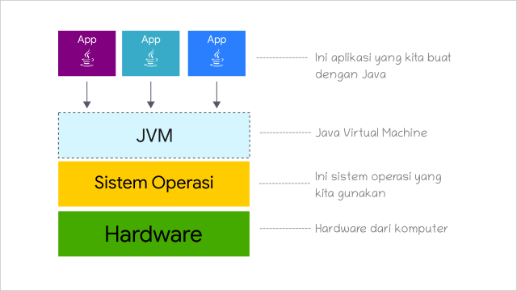

# 2 | Konsep Pemrograman Java yang Harus dipahami


## 1 | Apa itu Pemrograman

Pemrograman adalah proses yang dilakukan untuk membuat program komputer. Segala aktifitas yang dilakukan untuk membuat program disebut pemrograman atau _programming_.

Aktivitas ini meliputi:
- Analisis (_analisis permasalah_)
- Pembuatan algoritma atau solusi
- Coding (implementasi algoritma ke dalam bahasa pemrograman)

Terlalu banyak kesalahan dalam belajar pemrograman, disebabkan oleh banyaknya orang yang langsung masuk ke tahap implementasi, tanpa tahu cara menganalisis dan membuat algoritma. Padahal tahap implementasi adalah tahap terakhir.

Seperti kata _John Johnson_:

> First, solve the problem. Then, write the code.

Pertama-tama, pecahkan dulu masalahnya, lalu buat kodenya.

Banyak orang bisa menulis program, tapi tidak tahu apa yang akan dia buat. Ini karena mereka hanya belajar menulisnya saja.

Algoritma adalah cabang dari ilmu matematika yang mengajari kita berpikir logis untuk menyelesaikan masalah. Setidaknya, setelah belajar algoritma, kita dapat menciptakan solusi dari permasalahan yang tepat dan efisien. 

Baru setelahnya menulis atau mengimplementasikan program.

## 2 | Bagaimana Komputer Mengeksekusi Program
 Singkatnya, kita menulis dengan bahasa program yang didesain untuk mudah dipahami manusia. Lalu sebuah program menerjemahkanya menjadi angka atau sinyal biner yang terdiri dari hanya 1 dan 0, lalu sinyal ini diproses oleh prosesor dan akan membangkitkan dan mematikan aliran listrik pada rangkaian motherboard.
 


Manusia tidak bisa memberikan sinyal langsung dalam bentuk `1010101` ke prosesor, sehingga diciptakanlah bahasa assembly yang merupakan bahasa rakitan yang dibuat dari kode _mnemonic_ atau simbol. Bahasa assemblu akan diterjemahkan menjadi sinyal biner `1010101` oleh Assembler.

Tapi karena bahasa assembly masih cukup sulit dipahami manusia:

```assembly
mov 1, x
mov 2, y
add x, y
mov result
```

Maka diciptakanlah bahasa yang mudah dipahami manusia. Jadi, kita menulis program dengan bahasa yang lebih tinggi, lalu diterjemahkan ke bahasa assembly oleh _Compiler_, lalu assembler akan menerjemahkan bahasa assembly menjadi sinyal biner.

## 3 | Mengapa dibutuhkan JVM

Kita tidak akan pernah benar-benar puas dengan kecepatan prosesor saat ini. Karena itu, berbagai perusahaan terus berlomba mengembangkan prosesor terbaiknya.

Beberapa vendor ternama yang dikenal luas antara lain Intel, AMD, IBM, dan ARM.

Masalahnya, setiap vendor menggunakan kode register assembly yang berbeda. Akibatnya, program harus dikompilasi khusus untuk setiap jenis prosesor. Jika tidak, program hanya dapat dijalankan pada perangkat dengan prosesor tertentu — misalnya, hanya di prosesor Intel.


Untuk mengatasi hal ini, diciptakanlah mesin virtual, yaitu sistem yang meniru cara kerja prosesor agar dapat mengeksekusi program secara lintas platform.

JVM (Java Virtual Machine) adalah mesin virtual yang digunakan untuk menjalankan program Java.


Selama suatu perangkat memiliki JVM, program Java dapat dijalankan di sana — terlepas dari jenis prosesor atau sistem operasi yang digunakan.



## 4 | Proses