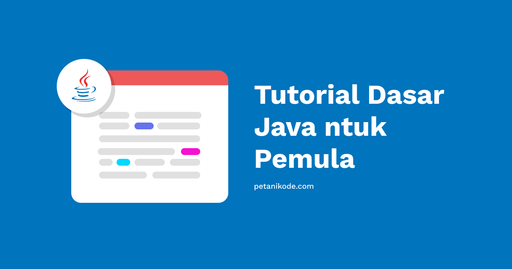

# 3 | Persiapan Pemrograman Java

Tutorial dari web asli hanya menjelasakan tentang menginstal software-software awal yang dibutuhkan untuk menjalankan Java.

Ada 2 tutorial terpisah, yaitu:
- [Java untuk Windows](https://www.petanikode.com/java-windows/)
- [Java untuk Linux](https://www.petanikode.com/java-linux/)

Pembahasan berputar tentang pemasangan JDK dan Netbeans, jadi kita skip! Baca langsung saja jika ingin mengikuti tutorialnya, karena bukan membahas sisi coding secara langsung.